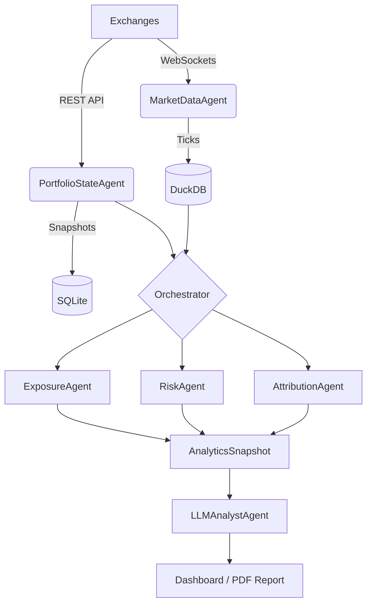

# System Architecture

## Overview
The Agentic Portfolio Analytics System allows for real-time risk monitoring and intelligence without execution privileges. It follows a modular, agent-based architecture where specialized agents handle data ingestion, state management, and analytical reasoning.

## Agent Taxonomy

### 1. Market Data Agent (`MarketDataAgent`)
- **Role**: Connects to Exchange WebSockets (Binance, Hyperliquid).
- **Data Flow**: Normalizes ticks -> DuckDB (`market_data.duckdb`).
- **Key Output**: Real-time price and funding rate feeds.

### 2. Portfolio State Agent (`PortfolioStateAgent`)
- **Role**: Aggregates account balances and positions.
- **Data Flow**: REST API (Read-Only) -> SQLite (`portfolio.db`).
- **Key Output**: `PortfolioSnapshot` containing equity, margin, and position details.

### 3. Analytic Agents
- **ExposureAgent**: Calculates Net/Gross exposure and Concentration (HHI).
- **RiskAgent**: Computes Rolling Drawdown and Parametric VaR.
- **AttributionAgent**: Decomposes PnL by asset.
- **ScenarioAgent**: Simulation engine for "What-If" analysis.

### 4. LLM Analyst (`LLMAnalystAgent`)
- **Role**: "Human-in-the-loop" reasoning.
- **Logic**: Consumes structured analytics -> OpenAI GPT-4 -> Executive Briefing.

### 5. Orchestration (`SystemOrchestrator`)
- **Role**: Coordinates the "Fetch -> Analyze -> Report" loop.
- **Cycle**: Runs every 1 minute to ensure fresh insights.

## Data Flow Diagram

## Tech Stack
- **Language**: Python 3.10+
- **Database**: DuckDB (TimeSeries), SQLite (State), SQLAlchemy (ORM)
- **API**: FastAPI
- **UI**: Streamlit
- **LLM**: OpenAI GPT-4

## Future Architecture Improvements

### 1. Execution Layer (`ExecutionAgent`)
-   **Purpose**: To handle `Order Management`.
-   **Design**: A separate, isolated execution engine that requires `WRITE` permission API keys.
-   **Safety**: Will run in a separate process or container to prevent accidental trades from the analytics layer.

### 2. Active Risk Engine (`RiskManager`)
-   **Purpose**: To implement `Risk Management System`.
-   **Design**: An event-driven supervisor that subscribes to `AnalyticsSnapshot` and `MarketData`.
-   **Action**: If a risk limit (e.g., VaR > 10%) is breached, it acts as a "Circuit Breaker," sending emergency close signals to the `ExecutionAgent`.

